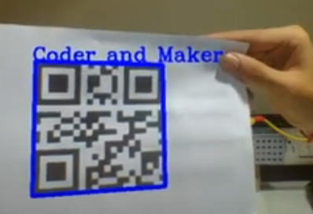

# Computer Vision: QR Tracking & Overlay

> **"Transform a flat camera feed into an interactive data layer. Master the math of spatial tracking and the logic of real-time computer vision."**

### Project Overview
This project challenges you to build a system that can "see" and interpret data in the physical world. Using **OpenCV** (or similar library), you will develop a pipeline to detect QR codes, decode their information, and render a digital "tag" or 3D overlay that sticks to the code as it moves, rotates, and scales within the live camera frame.

---

### The Requirements
* **Live Detection:** Your system must process a live webcam feed and identify one or more QR codes simultaneously.
* **Decoding & Tagging:** The software must extract the data from the code and display it as a dynamic label or graphic overlay on the video.
* **Spatial Tracking:** The overlay must be "anchored" to the code. If the code is tilted or moved closer to the lens, the overlay should scale and rotate in real-time to match the perspective.
* **Automation:** The system must be fully autonomous—detecting and tracking the markers without any manual user input or "clicking" to select the target.

---

### What You Will Learn
* **Image Processing Fundamentals:** You will learn how to convert video frames into grayscale, apply thresholding, and find contours to isolate markers from a noisy background.
* **Coordinate Transformations:** You will master the logic of mapping 2D pixel coordinates (where the code is on the screen) to 3D spatial orientations (how the code is tilted in the room).

* **Real-Time Performance:** You will explore how to optimize your code to maintain a high frame rate, ensuring the digital overlay doesn't "lag" behind the physical object.
* **Library Integration:** You will gain experience working with the **OpenCV** ecosystem, learning how to bridge raw hardware data from the camera with high-level computer vision algorithms.

---

### Key Technical Concepts & Resources
* **Platform Flexibility:** While **Python** is the most common choice for this project due to the robust `opencv-python` library, you can also implement this in **C++** for high performance or **Java** for mobile integration.
* **Pose Estimation:** Research how to use the `solvePnP` function in OpenCV to determine the object's position and orientation in 3D space.
* **Essential Math:** Familiarize yourself with **NumPy** for the matrix operations required to handle image arrays and coordinate projections.

> **Pro-Tip:** If your tracking is jittery, look into a **Kalman Filter**. It is a mathematical method used to "predict" the object's next position, resulting in much smoother overlays.

## Example Image
