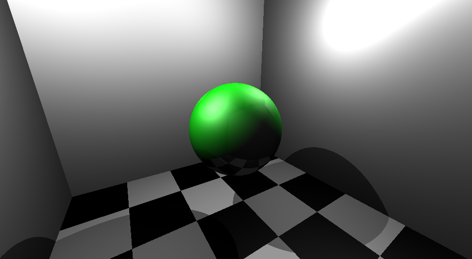

# Computer Science: Ray Tracer, from Scratch

## The Goal
Build a 3D rendering engine from absolute scratch in the language of your choice.

---

## What is Rendering?
In computer graphics, **rendering** is the process of turning a 3D scene—composed of mathematical points, shapes, and light sources—into a 2D image (the pixels on your screen). 

Most modern games use "Rasterization," which is fast but relies on "faking" light. Ray tracing, however, simulates the actual physics of how light moves.

## A Brief History
For decades, true photorealism was a pipe dream. In **1979**, computer scientist **Turner Whitted** published a groundbreaking paper that changed everything. He proposed that instead of projecting shapes *outward* to the screen, we should follow rays of light *backward* from the eye. This was the birth of **Recursive Ray Tracing**.

## How It Works (At a High Level)
Ray tracing mimics the universe. Instead of asking "Where does this triangle go?", the computer asks, "What does the eye see through this pixel?"

* **Cast a Ray:** For every pixel on your screen, the engine "shoots" an imaginary line (a ray) into the virtual world.
* **Find the Hit:** The math checks if that ray hits an object. If it hits a sphere, the engine calculates the exact coordinate of that collision.
* **Calculate Light:** Once a hit is found, the engine looks at the light sources. It asks: "Is there a clear line to the sun, or is this point in a shadow?"
* **The Bounce:** If the surface is reflective, the engine "bounces" the ray to see what else is visible, creating realistic reflections.

---

## Technical Constraints
To truly understand the math, you must follow these rules:
1. **No Shortcuts:** You may **not** use OpenGL, DirectX, Vulkan, or any 3D engines (Unity/Unreal).
2. **Direct Pixels:** You must use a basic UI library (like Python’s Tkinter, Java Swing, or C++ SDL) to set individual **pixel colors** in a window.
3. **Pure Math:** You are responsible for calculating ray-object intersections and shading models.

## Example Output

---

## Recommended Resources
* *Ray Tracing in One Weekend* by Peter Shirley
* *Scratchpixel 2.0* (Online Lessons)