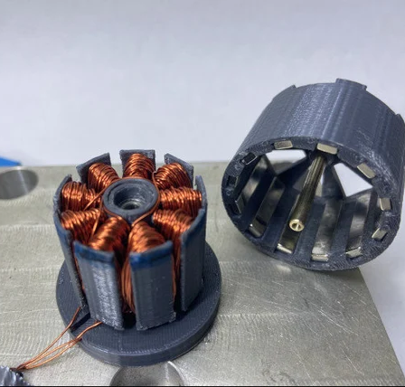

# Engineering Challenge: The 3D-Printed Motor

## The Goal
Design (in CAD), 3D print, and build a functional electric motor. You are converting electrical energy into mechanical rotary motion using wire coils (electromagnets), permanent magnets, and 3D-printed components.

---

## Choose Your Path
There are three ways to solve this challenge. Each one shifts the "engineering difficulty" to a different domain:

### 1. The Brushed Motor (Mechanical Logic)
The "classic" motor. It uses physical contacts to flip the electromagnetic field as it spins.
* **The Challenge:** Designing a 3D-printed **commutator** and **brush system**. You must manage friction and heat, as the brushes will spark and rub against the rotating shaft.
* **Control:** Lowest difficulty, but still very challenging. It should spin when connected directly to a DC power supply.

### 2. The Brushless Motor (Electronic Logic)
Modern, efficient, and powerful. It has no physical brushes; the "switching" is handled by a computer.
* **The Challenge:** Precise tolerances. You must maintain a tiny "air gap" between the stator and rotor (usually <1mm).
* **Control:** High difficulty. You **must** use an Electronic Speed Controller (ESC) or program a microcontroller to pulse the three phases in the correct sequence.

### 3. The Solenoid Motor (Reciprocating Logic)
Essentially an "internal combustion engine" powered by magnets. A piston is pulled into a coil, and a crankshaft converts that linear motion into rotation.
* **The Challenge:** Mechanical timing. You must design a cam or a sensor to turn the coil on and off at the exact right moment in the stroke.
* **Control:** Medium difficulty. Requires a physical or electronic timing mechanism.

---

## Technical Constraints
To ensure you are "Engineering" and not just "Assembling," you must follow these rules:

1.  **Hand-Wound Coils:** You may not use pre-made electromagnets. You must calculate your own "turns" and wind the enamel copper wire yourself.
2.  **Structural Printing:** All structural parts (stator, rotor, frame, or piston) must be your own 3D designs.
3.  **The "No-Kit" Rule:** Aside from bearings, magnets, wire, and a shaft (bolt/dowel), everything must be custom-made. 
4.  **Stability:** The motor must be able to run for **60 seconds** continuously without melting the 3D-printed frame or vibrating itself apart.

---

## How It Works (At a High Level)
* **Electromagnetism:** When electricity flows through a coil, it creates a magnetic field.
* **Lorentz Force:** This field interacts with permanent magnets to create a "push" or "pull" force.
* **Commutation:** For a motor to spin in a full circle, the magnetic field must "flip" at the right time. If it doesn't, the motor will just "cog" (jerk back and forth), draw high current, and overheat.

---

## Recommended Resources
* **The "Right-Hand Rule":** Understanding how current direction creates magnetic poles.
* **Winding Patterns:** Research "dLRK" for Brushless or "Lap Winding" for Brushed.
* **Material Science:** Check the **Glass Transition Temperature** of your filament. PLA softens at ~60°C; if your coils get hot, your motor will collapse. Consider PETG or ABS for higher heat resistance.

## Example Output
