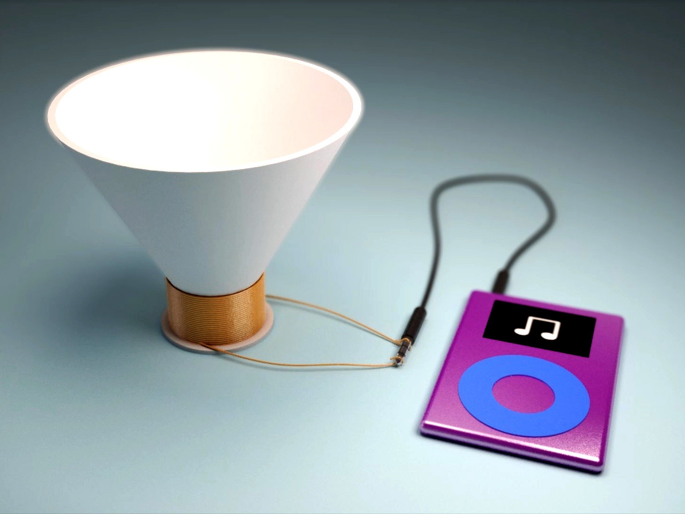

# DIY Speaker & Analog Amplifier

> **"Experience the physics of sound by turning electricity into motion. Bridge the gap between mechanical vibration and integrated circuit design."**

### Project Overview
Design and build a functional speaker and amplifier from the ground up. You will engineer a mechanical suspension system to keep a hand-wound voice coil centered over a permanent magnet. Additionally, you will build a solid-state amplifier circuit, learning to use an Integrated Circuit (IC) to boost low-power audio signals into enough current to drive your custom hardware.

---

### The Requirements
* **Electromagnetic Design:** You must wind your own voice coil using enamelled magnet wire. Pre-built drivers or scavenged speaker parts are prohibited; the electromagnetic core must be your own work.
* **Mechanical Suspension:** You must design and 3D print a frame that supports a cone (paper, fabric, or plastic) and keeps the coil perfectly aligned within the "air gap" of your magnets without friction.
* **The "Amp" Challenge:** You must assemble a functional circuit to drive the speaker.
    * **Standard:** Use an **LM386 IC** to create a classic analog amplifier with adjustable gain.
    * **Efficiency Upgrade:** Use a **PAM8403 IC** to explore Class-D (digital) amplification for higher efficiency.
* **Audio Input:** The system must be capable of playing recognizable audio from a standard 3.5mm jack or a mobile device.

---

### What You Will Learn
* **Electromagnetism in Motion:** You will learn how the Lorentz force ($F = I \ell \times B$) converts electrical current into the physical thrust needed to move a speaker cone.
* **Acoustics & Resonance:** You will discover how the shape and material of your "cone" affect the frequency response and volume of the sound produced.
* **Reading Datasheets:** By integrating the LM386 or PAM8403, you will learn to navigate technical documentation to determine pinouts, voltage limits, and gain settings.

* **Signal Integrity:** You will explore the importance of **decoupling capacitors** and grounding to prevent unwanted noise or "hum" in your audio output.

---

### Key Technical Concepts & Resources
* **Impedance Matching:** Use Ohm’s Law ($V = IR$) to calculate the resistance of your hand-wound coil. Aiming for $4\Omega$ to $8\Omega$ is standard for most small amplifiers.
* **3D Design for Vibration:** Research "compliant mechanisms" to 3D print a flexible suspension (the spider) that holds the coil in place but allows it to travel linearly.
* **Soldering & Prototyping:** Practice breadboarding your circuit first before moving to a permanent soldered PCB or perfboard.

> **Pro-Tip:** The secret to a loud speaker isn't just a bigger magnet—it's the **Air Gap**. The closer your coil is to the magnet without touching it, the more efficiently the magnetic flux will drive your cone.

## Sample Build 
