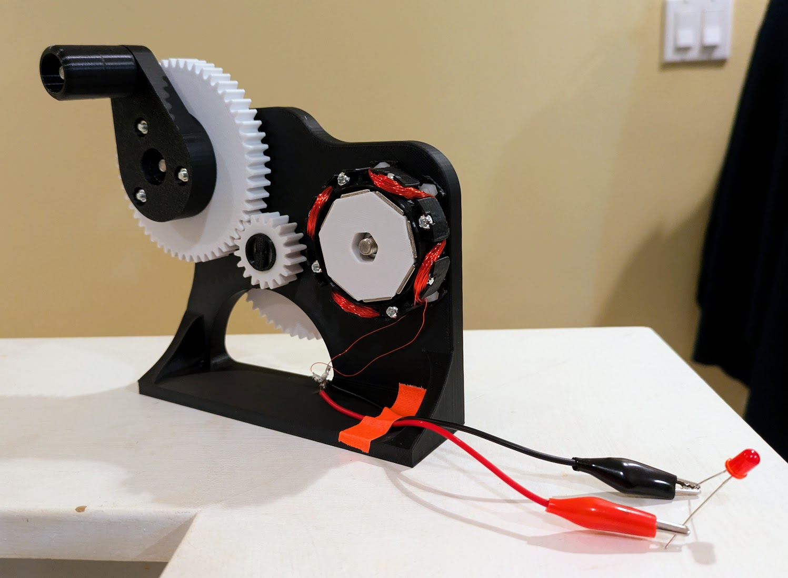

# Hand-Crank Turbine

### Project Overview
The goal of this project is to build a functional hand-crank turbine that converts mechanical motion into electrical energy. You will explore Faraday’s Law of Induction by building your own generator from scratch and lighting a pair of LEDs using raw Alternating Current (AC).

### The Requirements
* **The "Single Strand" Rule:** You must wind your own continuous coil of copper wire. Using a pre-made motor is prohibited; the stator and rotor must be your own design.
* **Anti-Parallel Circuit:** To avoid the complexity of a rectifier, connect two LEDs in **anti-parallel** (the positive lead of one to the negative lead of the other). This allows you to "see" the AC current as the LEDs take turns firing during each half-cycle.
* **Mechanical Advantage:** Your design must include a gear system to increase the rotor RPM. A standard hand-crank speed is usually too slow to reach the "strike voltage" of an LED without a mechanical speed booster.

---

### What You Will Learn

* **Mechanical Engineering:** You will learn about gear ratios and torque—balancing how hard it is to turn the crank versus how much electricity is generated.
* **Precision Assembly:** You will experience the importance of "air gaps"—the smaller the space between your magnets and coils, the more efficient your generator becomes. This is one of those notorious "rabbit hole" projects that often requires precise tuning and iteration.
* **Electromagnetic Induction:** You will discover how moving magnetic fields "push" electrons through a wire and how the number of turns in your coil directly scales the output voltage.
* **Understanding AC vs. DC:** By using a single strand and two LEDs, you will see firsthand how current flips direction every half-turn of the rotor.

---

### Key Technical Concepts & Resources

* **Must-Watch Guide:** [DIY Electric Generator - Magnets & Copper Wire](https://www.youtube.com/watch?v=Bno0EQrQ6RU) – This video is a great resource for this project. It uses an oscilloscope to show exactly how different magnet orientations and coil windings create electricity, though most DMM can also measure the voltage of an AC signal.
* **Faraday's Law:** Research how the rate of change in a magnetic field determines your brightness.
* **Visualizing AC:** Check out the [Faraday's Law Simulation](https://phet.colorado.edu/en/simulations/faradays-law) to see a virtual version of this project in action.

## Example Build
