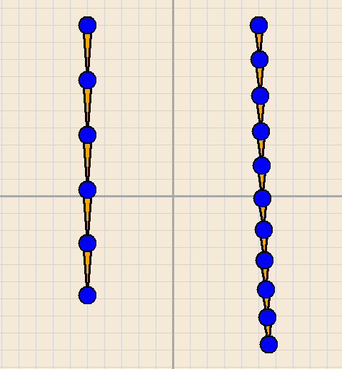

# Applied Mathematics: The FK/IK Chain (Forward & Inverse Kinematics)

## The Goal
Build a stable, multi-jointed skeletal chain simulation from scratch that supports both direct simulation (**Forward Kinematics**) and goal-oriented movement (**Inverse Kinematics**). The chain should enforce a fixed segment lengths, with only minor stretch.

---

## What is Kinematics?
In robotics and animation, **kinematics** is the geometry of motion. It describes how parts of a system move in relation to one another without yet considering the forces (like gravity or friction) that cause that motion.

* **Forward Kinematics (FK):** This is the parent/child relationship (shoulder, elbow, wrist). Your simulation calculates where the "end effector" (the hand) lands based on the position and angle of the parent joints.
* **Inverse Kinematics (IK):** You define a target for the hand. The computer must "solve" the math to determine the necessary joint angles to reach that target. 

## A Brief History
IK was originally a problem for **industrial robotics** in the 1960s—getting a robotic arm to weld a specific point on a car frame. By the 1990s, game developers realized they needed IK to stop a character's feet from sliding through the floor on uneven terrain. Modern physics engines now use **Position Based Dynamics (PBD)** to keep these chains stable and realistic under stress.

## How It Works (At a High Level)
To make a chain move realistically without it "exploding" or jittering, you must respect the physical constraints of the bones.

* **The Chain:** Represent your arm as a series of points (joints) connected by fixed lengths (bones).
* **Verlet Integration:** Instead of calculating velocity ($v = v + a \times dt$), you store the *current* and *previous* positions. This makes the simulation significantly more stable when constraints are applied. Do some research, it is well documented.
* **The Solver (Relaxation):** When you move the "hand" toward a target, the bone lengths will naturally stretch and break. You must perform **Relaxation Steps**—iteratively moving the points back toward their allowed distance until the chain is "satisfied." This steps helps take the excess energy out of the system to keep the system stable, with fixed segment lengths.
* **Stability:** By running multiple solver iterations per frame, the chain appears rigid and physical rather than stretchy or "mushy."

---

## Technical Constraints
To master the physics of constraints, you must follow these rules:
1.  **No Physics Engines:** You may **not** use Box2D, P2, or built-in engine physics (Unity/Unreal).
2.  **Stable Integration:** Use **Verlet Integration** or a similar displacement-based method. Avoid simple Euler integration.
3.  **The Solver:** Implement an iterative solver (such as **FABRIK** or **CCD**) to handle the IK movement.
4.  **Visuals:** Render the joints and bones clearly using simple lines and circles (a 2d library is recommended here). 

## Example Output

---

## Recommended Resources
* *Advanced Character Physics* by Thomas Jakobsen (The definitive paper on Verlet/Constraints)
* *FABRIK: A fast, iterative solver for the Inverse Kinematics problem* by Aristidou and Lasenby
* *Coding Math* (YouTube series) - Episodes on Inverse Kinematics