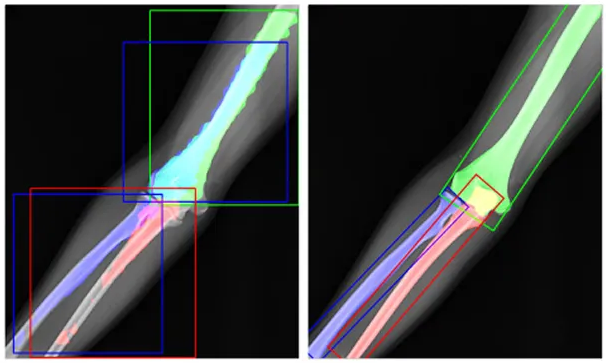
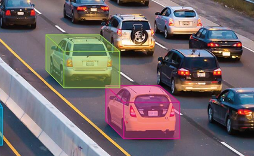

# PCA-Based Oriented Bounding Box (OBB)

### Project Overview
The goal of this project is to use **Principal Component Analysis (PCA)** to find the minimum Oriented Bounding Box (OBB) within an image or spatial dataset. Unlike standard axis-aligned boxes, an OBB rotates to align with the object's natural orientation, providing a precise geometric fit.

### The Requirements
* **Platform/Language:** Use any language (Python, C++, MATLAB, etc.) and any platform.
* **The PCA Rule:** You may use a matrix library (like NumPy or Eigen) for linear algebra, but **you must implement the PCA algorithm yourself.** Do not use "black box" functions (e.g., `sklearn.pca` or `cv2.PCACompute`).
* **The Process:**
    1. **Segmentation:** Start with a raw image. Implement a form of segmentation (thresholding, masking, etc.) to isolate the target object.
    2. **Custom PCA:** Extract the $(x, y)$ coordinates of the segmented pixels and perform your own PCA to identify the principal axes of variance.
    3. **Visualization:** Use the resulting eigenvectors to define the OBB’s rotation and dimensions, then draw the resultant box.

---

### Challenge Levels

#### 🟢 Core Task: 2D Spatial Analysis
Process 2D images by converting a binary mask into a set of coordinates. Use a $2 \times 2$ covariance matrix to find the primary and secondary axes.
* **Goal:** Successfully draw a rotated rectangle around a single object regardless of its orientation.

#### 🔵 Extra Challenge: 3D Pose Estimation
Looking for more? Identify the **3D pose** of an object within a 2D image. Generate a 3D OBB.
* **The Task:** Use a library like OpenCV to assist with segmentation, but use your custom PCA implementation to determine the object's 3D orientation/basis-vectors and OBB.
* **Goal:** Project a 3D cuboid onto a 2D image that accurately represents the object's minimum OBB in 3D space.

---

### Key Technical Concepts & Resources

* **Visual Intuition:** Watch [StatQuest: Principal Component Analysis (PCA) clearly explained](https://www.youtube.com/watch?v=FgakZw6K1QQ) for a great breakdown of how the axes are calculated.
* **Covariance Matrix:** Captures how the data points spread across the image.
* **Eigenvectors & Eigenvalues:** These define the direction and the magnitude (length/width) of your box axes.

> **Pro-Tip for Implementation:** To write PCA yourself, the general workflow is: 
> 1. Center your data (find the mean). 
> 2. Calculate the Covariance Matrix from your relative data points. 
> 3. Calculate the Eigenvectors/Eigenvalues of that matrix.

## Examples (2D and 3D)

