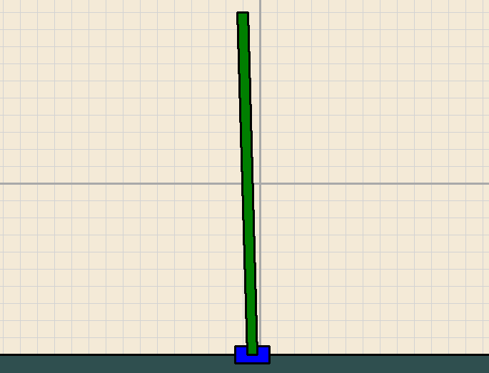

# Applied Mathematics: PID Controller for an Inverted Pendulum

## The Goal
Create a physics-accurate simulation of an inverted pendulum (a "cart-pole" system) and write a control algorithm to keep the pole balanced vertically.

---

## What is Control Theory?
In engineering, **Control Theory** deals with influencing the behavior of dynamic systems. Balancing an inverted pendulum is the "Hello World" of control theory. 

Unlike a standard pendulum that hangs down (stable equilibrium), an inverted pendulum wants to fall (unstable equilibrium). To keep it up, the base must constantly move to stay directly under the center of mass. This is exactly how rockets stay upright during launch (Gimbaled Thrust) and how Segways stay balanced.

## How It Works
1.  **The Physics:** You must simulate the gravity, angular velocity, and friction of the pole. If the pole tilts 5 degrees to the left, the cart must accelerate to the left to "catch" it.
2.  **The Sensor:** Your controller needs to "read" the current angle ($\theta$) and the angular velocity ($\dot{\theta}$) of the pole.
3.  **The Controller:** You apply a force ($F$) to the cart based on those readings.

### Control Strategies
Pick your poison. Start with the basics and when you have that working, if you want more, then try the next method.
* **PID (Proportional-Integral-Derivative):** The most common controller. It looks at the current error, the history of error, and the speed of the error to calculate the next move.
* **LQR (Linear Quadratic Regulator):** A more advanced "optimal" controller that uses matrix math to find the most efficient path to balance.
* **MPC (Model Predictive Control):** The "heavy hitter." It simulates the future results of its actions before it takes them.

---

## Technical Constraints
1.  **From-Scratch Physics:** Do not use a physics engine. You must calculate the torque and acceleration of the pole using basic dynamics.
2.  **The "Kick" Test:** Your simulation must include a way to "nudge" the pole with the mouse. A successful controller should be able to recover and return to a perfect vertical state.
3.  **Real-Time Visualization:** Render the cart and pole clearly. Considering adding a live graph of the "Error" (the difference between current angle and vertical).

[Image of PID controller block diagram]

---

## Technical Milestones
* **Level 1:** Build the physics simulation where the pole simply falls and swings freely.
* **Level 2:** Implement a **P-Controller** (Proportional). Notice how it overshoots and oscillates wildly.
* **Level 3:** Implement a full **PID Controller**. Tune the $K_p$, $K_i$, and $K_d$ gains until the pole is rock-solid.
* **Level 4 (Hard Mode):** Implement the "Swing Up" challenge. Start the pole hanging down and program the cart to swing it back and forth until it gains enough momentum to flip up and catch it.

## Recommended Resources
* **"Control Boot Camp"** by Steve Brunton (YouTube) - The best explanation of the math behind this.
* **PID Explained:** Research "Ziegler-Nichols Method" for tuning your gains.
* **Underactuated Robotics:** MIT OpenCourseWare notes on the Cart-Pole problem.

## Example Output
