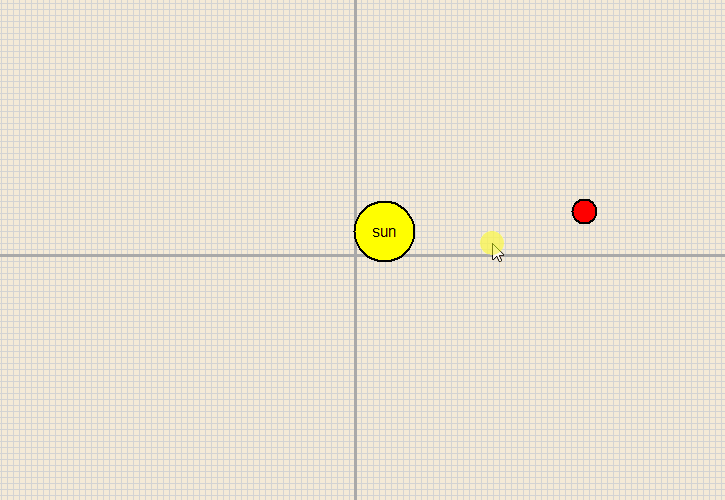

# Engineering Challenge: The Three-Body Problem

## The Goal
Build a high-precision gravitational simulator to model the interaction of three or more celestial objects. You will demonstrate why this historic problem cannot be solved with a single formula, but must instead be conquered through numerical integration and raw computing power.

---

## The Historic "Problem"
In 1687, Isaac Newton solved the **Two-Body Problem** (e.g., a single planet orbiting a star). He provided a "closed-form" solution—a simple equation that predicts positions for eternity. 

However, when a third object is added, the math becomes "non-integrable." There is no general formula to predict the long-term paths of three bodies. Because the system is **chaotic**, the smallest change in starting position can lead to a completely different outcome over time. This is the cornerstone of **Chaos Theory**.

## How It Works: Discrete Simulation
Since we cannot jump to the future with one equation, we must "step" through time using **Numerical Integration**. 

### 1. The Physics (The "Big-G" Constant)
Unlike a simple game where gravity is a made-up number, your simulation must use the real **Universal Law of Gravitation**:

$$F = G \frac{m_1 m_2}{r^2}$$

Where $G = 6.67430 \times 10^{-11} \text{ m}^3\text{kg}^{-1}\text{s}^{-2}$. 

Using the real constant requires you to handle massive differences in scale. You must decide how many "meters" a single pixel represents and how many "seconds" pass in a single simulation "tick."

### 2. High-Accuracy Integration
Simple "Euler" integration ($v = v + a; p = p + v$) is numerically unstable for orbits; it adds energy to the system, causing planets to spiral outward. To solve this, you must implement more accurate methods:
* **Velocity Verlet:** A "Symplectic" integrator that preserves the energy of the system over long periods.
* **Runge-Kutta (RK4):** A 4th-order method that takes four "samples" per time step to cancel out errors.

---

## Technical Constraints
1. **Scientific Accuracy:** Use the real value of $G$. Your internal units should be SI (kilograms, meters, seconds), even if you scale them for the screen.
2. **Interactive Sandbox UX:** Users must be able to:
    * Click and drag to place a body and set its initial **velocity vector**.
    * Input specific masses for each object.
    * Adjust the "Time Step" ($dt$) to speed up or slow down the universe.
3. **Visual Trails:** Implement persistent "ribbons" or paths that show the history of the objects' movements to reveal the complex geometry of their orbits.
4. **Collision Handling:** Implement a "Softening Factor" (an $\epsilon$ added to the distance) to prevent infinite forces and "teleporting" when two objects get too close.

---

## Recommended Resources
* **Numerical Integration:** Research the **Velocity Verlet** algorithm for orbital stability.
* **Special Cases:** Look up the "three-body periodic solutions" gallery for initial conditions to test.

## Example Output
