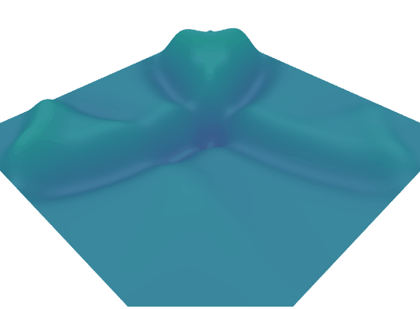

# 2D Wave Equation Solver

> **"Translate the calculus of the natural world into code. Move beyond pre-made physics engines and build a simulator from the first principles of wave mechanics."**

### Project Overview
The goal of this project is to simulate how waves propagate through a medium—like ripples on a pond or sound in a room. Using the **Finite Difference Method (FDM)**, you will discretize the continuous wave equation, allowing you to calculate the future state of a 2D grid based on its previous time steps.

---

### The Requirements
* **From-Scratch Solver:** You must implement the mathematical update rule yourself. Using a physics library (like Matter.js or PhysX) to handle the wave logic is prohibited.
* **Grid-Based Simulation:** The simulation must run on a 2D grid (array of values) where each cell's "height" is influenced by its neighbors.
* **Real-Time Interaction (Advanced Challenge):** Users should be able to "poke" the simulation (disturb a point on the grid) and watch waves propagate, reflect off boundaries, and interfere in real-time.
* **Pre-Simulated Animation (Standard Challenge):** For a reduced challenge, you may pre-calculate all frames of the simulation and render them as a video or GIF. **Python** with **NumPy** and **Matplotlib** is highly recommended for this path.
* **Visualization:** Render the grid using a 2D heat map (top-down) or a 3D surface plot to show the peaks and troughs of the waves.

---

### What You Will Learn
* **Numerical Analysis:** You will learn how to turn a partial differential equation (PDE) into a discrete algorithm that a computer can solve iteratively.
* **Boundary Conditions:** You will discover how to handle the edges of your grid—implementing "Reflective" boundaries (where waves bounce back) or "Absorptive" boundaries.

* **Stability & Time-Stepping:** You will encounter the **CFL condition**, learning why picking a time step ($\Delta t$) that is too large relative to your grid spacing ($\Delta x$) can cause your simulation to "explode" mathematically.
* **High-Performance Computing:** Since you are updating every pixel/cell every frame, you will learn to optimize nested loops or leverage vectorized operations (like NumPy) to keep the simulation fluid.

---

### Key Technical Concepts & Resources
* **The Discrete Wave Equation:** Research the core update rule for a grid:
  $$u_{i,j}^{n+1} = 2u_{i,j}^n - u_{i,j}^{n-1} + c^2 \frac{\Delta t^2}{\Delta x^2} (u_{i+1,j}^n + u_{i-1,j}^n + u_{i,j+1}^n + u_{i,j-1}^n - 4u_{i,j}^n)$$
* **Platform Suggestions:** * **Python (Pre-Simulation):** Use **NumPy** for fast matrix math and **Matplotlib.animation** to render the results.
    * **Web (Real-Time):** Use **p5.js** or a raw **HTML5 Canvas** for interactive browser-based ripples.
    * **C++/Rust (High Performance):** Use **SFML** or **SDL** to handle thousands of grid points at high frame rates.

> **Pro-Tip:** If your simulation "blows up" (values go to infinity), check your Courant number. For a stable 2D simulation, ensure that $c \frac{\Delta t}{\Delta x} < \frac{1}{\sqrt{2}}$.

## Example Output
